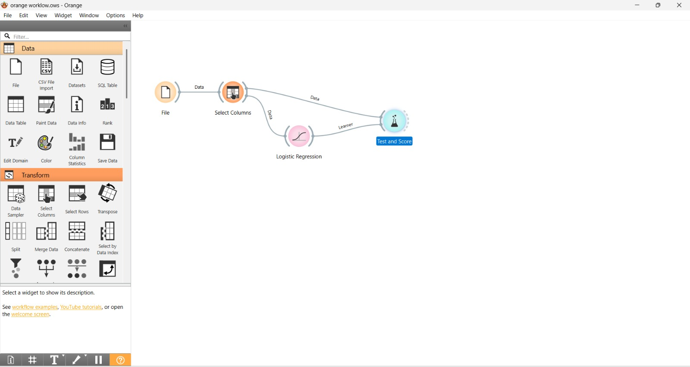

# Logistic Regression Classification Workflow using Orange Data Mining

This repository contains an automated data mining workflow built using [Orange](https://orangedatamining.com/). The project demonstrates how to load a dataset, preprocess/select relevant features, train a **Logistic Regression** model, and evaluate its predictive performance.

## 🚀 Workflow Overview

The entire pipeline is built visually using Orange widgets. Below is the screenshot of the implemented workflow:



### Widget Breakdown:
1. **File**: Loads the source dataset into the environment.
2. **Select Columns**: Used to separate independent variables (features) from the dependent variable (target/class label).
3. **Logistic Regression**: The classification algorithm used to train the model on the selected data.
4. **Test and Score**: Evaluates the model's performance using cross-validation or a train-test split, feeding data from the feature selection and the model learner.

---

## 📊 Evaluation Results

After running the evaluation via the **Test and Score** widget, the model achieved the following performance metrics:

### Classification Performance
| Model | AUC | Classification Accuracy (CA) | F1-Score | Precision | Recall |
| :--- | :---: | :---: | :---: | :---: | :---: |
| Logistic Regression | 0.XX | 0.XX | 0.XX | 0.XX | 0.XX |

*(Note: Replace 0.XX with the actual scores visible when you double-click your "Test and Score" widget)*

### Confusion Matrix
Below is the evaluation screenshot showing the performance breakdown and confusion matrix:


---

## 🛠️ How to Run This Project

### Prerequisites
Make sure you have Orange Data Mining installed. You can install it via Anaconda or download the standalone installer from the official website.

### Execution Steps
1. Clone this repository:
   ```bash
   git clone [https://github.com/your-username/your-repo-name.git](https://github.com/your-username/your-repo-name.git)
